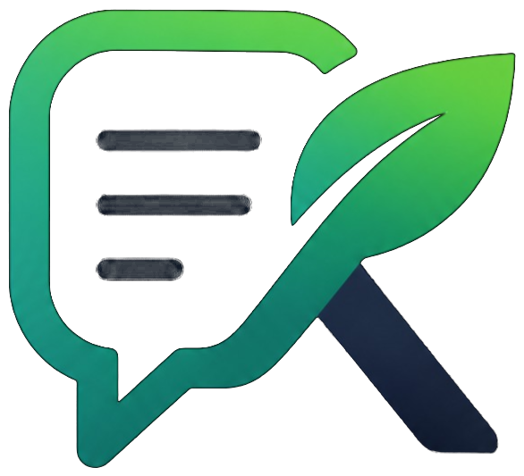
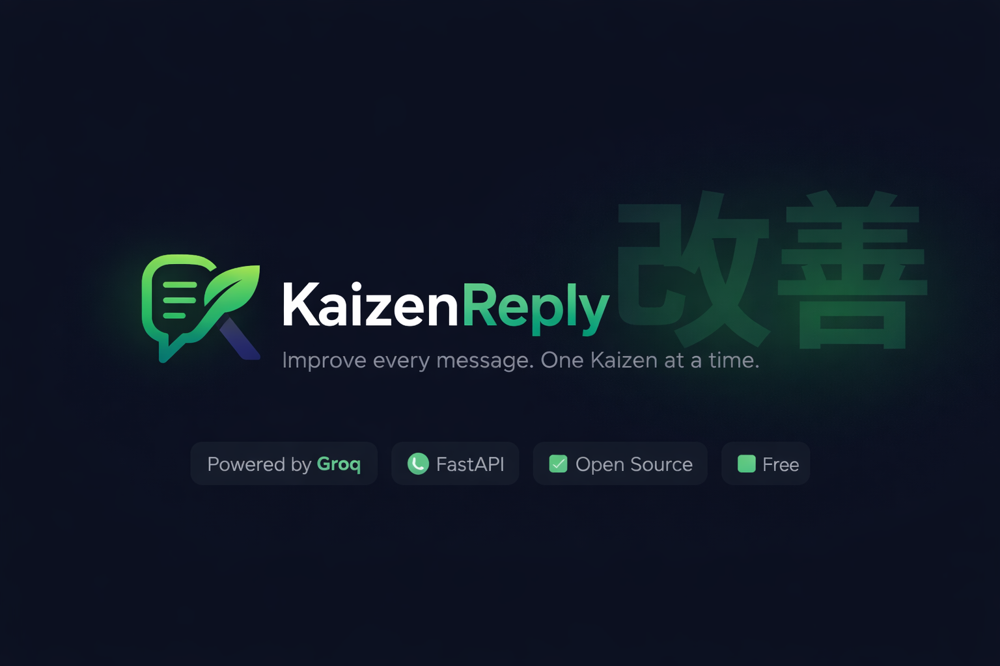

# KaizenReply

<p align="center">
  
</p>

<p align="center">
  
</p>

<p align="center">
  <a href="https://kaizenreply.vercel.app"></a>
  <a href="LICENSE"></a>
  <a href="https://fastapi.tiangolo.com/"></a>
  <a href="https://groq.com/"></a>
  
</p>

> **Messages don't get rewritten. They evolve. Improve every message, one Kaizen at a time.**

**改善** — *Kaizen* is a Japanese word meaning **"change for the better"** or **"continuous improvement"**. It's a philosophy rooted in making small, consistent refinements rather than sweeping overhauls. Applied to communication — every message you send can be a little clearer, a little more fitting, a little better than the last draft. That's the idea behind KaizenReply.

---

## 💭 Why I Built This

Honestly? I was tired of copy-pasting my messages into ChatGPT just to fix grammar or make them sound less casual before sending. Every time — open a new tab, paste the message, type "fix this", wait, copy the result back. It works but it's annoying when you're doing it ten times a day.

So I thought — why not just build my own thing? A minimal web tool where I paste my message, pick a tone, and get the improved version instantly. No extra tabs, no prompting, no context switching.

Once I had that working, I figured it'd actually be useful for others too. Not everyone is comfortable with AI tools, and a lot of people just want a simple "make this message sound better" button without any of the AI wrapper complexity.

The Kaizen philosophy felt like the right name for it — the idea that every message can be made slightly better, one small refinement at a time. Not a full rewrite, just a continuous improvement. That's exactly what this does.

I also thought about adding screenshot support — paste a screenshot of a message and have it extract + improve the text. That would be genuinely useful. Not implementing it right now, but it's on the list for when I get around to it.

---

## ✨ Features

- 🧠 **AI-Powered Evolution** — Powered by **Groq + Llama 3.3 70B**. Fast, free, high quality.
- 🎭 **10 Tone Presets** — Casual, Professional, Polite, Formal, Friendly, Gen Z, Persuasive, Assertive, Diplomatic, Concise. Plus custom tone input.
- 📱 **Platform-Aware Output** — WhatsApp, LinkedIn, Email, Telegram, Instagram, Facebook, SMS, Discord, X (Twitter), or platform-neutral.
- 📏 **Hard Character Limits** — Enforces SMS (160) and X/Twitter (280) constraints at the prompt level.
- 💬 **Conversation Context** — Optional chat history and recipient description for smarter tone matching.
- 🔄 **Reply Mode** — Suggests 3 distinct, ready-to-send replies for any message you receive.
- 📊 **Kaizen Score** — Side-by-side Before → After comparison with a breakdown across Clarity, Tone, Professionalism, and Readability.
- 🤖 **AI Tone Suggestion** — Let the model analyse your draft and recommend the best tone.
- 📋 **One-Click Copy & Share** — Copy evolved text or share via Web Share API.
- 🌗 **Dark / Light Mode** — Persisted in localStorage, smooth transitions.
- 🔒 **Anti-Spam Guard** — 1-second per-IP cooldown + 5-minute response cache.

---

## 🧱 Tech Stack

| Layer | Technology |
|---|---|
| **Frontend** | Plain HTML5, Vanilla CSS, ES6 JavaScript — zero build steps |
| **Backend** | FastAPI (Python, ASGI) + Uvicorn |
| **AI Model** | Groq `llama-3.3-70b-versatile` |
| **HTTP Client** | httpx (async) |

---

## 🚀 Quick Start

### 1. Clone & Enter
```bash
git clone https://github.com/MKishoreDev/KaizenReply.git
cd KaizenReply
```

### 2. Set Up Virtual Environment
```bash
python -m venv .venv
source .venv/bin/activate        # Windows: .venv\Scripts\activate
```

### 3. Install Dependencies
```bash
pip install -r requirements.txt
```

### 4. Configure Environment
Create a `.env` file in the root:
```env
# Get your free key at https://console.groq.com/keys
GROQ_API_KEY=your-groq-api-key-here
GROQ_MODEL=llama-3.3-70b-versatile
```

> **Groq Free Tier:** ~14,400 requests/day · 30 RPM · No credit card required.

### 5. Run the Server
```bash
python -m uvicorn app.main:app --reload --port 8000
```
Open **http://localhost:8000** in your browser.

---

## 🌐 Deployment

For **Railway**, **Render**, or **Fly.io** — set env vars in the platform dashboard, no `.env` file needed. The app reads `os.getenv()` directly, with `.env` as a local-only fallback.

```
GROQ_API_KEY=your-groq-api-key-here
GROQ_MODEL=llama-3.3-70b-versatile
```

---

## 🔌 API Reference

### `POST /api/improve`
Evolves a draft message based on tone, platform, and context.

**Request:**
```json
{
  "message": "bro send that file asap",
  "tone": "Polite",
  "platform": "Email",
  "conversationContext": "",
  "recipient": "Manager"
}
```

**Response:**
```json
{
  "improved": "Hi, could you please send the file when you get a chance? Thanks!",
  "score": {
    "before": 52,
    "after": 91,
    "breakdown": { "clarity": 18, "tone": 24, "professionalism": 14, "readability": 21 }
  }
}
```

---

### `POST /api/reply`
Generates 3 ready-to-send replies for a received message.

**Request:** Same fields as `/api/improve`.

**Response:**
```json
{ "suggestions": ["Reply 1", "Reply 2", "Reply 3"] }
```

---

### `POST /api/analyze`
Recommends the best tone for a draft message.

**Request:** `{ "message": string }`

**Response:** `{ "tone": string, "platform": "", "reason": string }`

---

### `GET /health`
```json
{ "status": "ok", "model": "llama-3.3-70b-versatile" }
```

---

## 📁 Project Structure

```
KaizenReply/
├── app/
│   ├── main.py          # FastAPI routes, Groq client, anti-spam, cache
│   └── models.py        # Pydantic request & response schemas
├── static/
│   ├── index.html       # Full SaaS UI (no framework)
│   ├── styles.css       # Vanilla CSS design system — dark/light, responsive
│   ├── app.js           # Frontend logic — modes, chips, copy, share, cooldown
│   ├── logo.png
│   └── banner.png
├── requirements.txt
├── .env.example                # Local dev only — not committed
├── Dockerfile
├── LICENSE
└── README.md
```

---

## 🐳 Docker

```bash
docker build -t kaizenreply .
docker run -p 8000:8000 -e GROQ_API_KEY=your-key kaizenreply
```

---

## 🤝 Contributing

1. **Fork** this repository
2. **Create a branch** — `git checkout -b feature/YourFeature`
3. **Commit** — `git commit -m 'Add YourFeature'`
4. **Push** — `git push origin feature/YourFeature`
5. **Open a Pull Request**

### Ideas to Hack On
- 📸 Screenshot support — paste an image, extract text, improve it
- 🔌 Swap in Claude, Gemini, or a local Ollama model
- 🌍 Multi-language support
- 🎨 More theme presets

---

## 📄 License

MIT License — see [LICENSE](LICENSE) for details.
