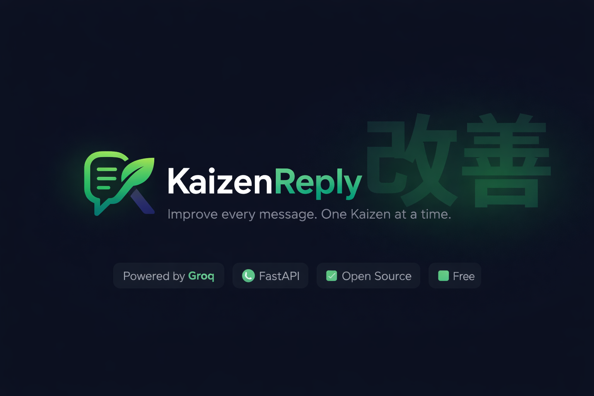

<p align="center">
  
</p>

# KaizenReply (改善)

<p align="center">
  <strong>The open-source, sub-second editorial desk that refines your drafts without turning them into generic AI slop.</strong>
</p>

<p align="center">
  <a href="https://kaizenreply.us.ci"></a>
  <a href="https://github.com/MKishoreDev/KaizenReply/actions/workflows/ci.yml"></a>
  <a href="LICENSE"></a>
  
  <a href="https://fastapi.tiangolo.com/"></a>
  <a href="https://groq.com/"></a>
  <a href="CONTRIBUTING.md"></a>
</p>

<p align="center">
  <em>"Don't rewrite. Refine. 小さな改善、確かな言葉。"</em>
</p>

---

## 💡 The Problem with Modern Writing Tools

Let's be completely honest about the current state of writing assistants:

1. **Rule-based checkers (LanguageTool, Harper)** are fast and privacy-respecting, but they are blind to tone, social nuance, and platform context. They can catch a comma splice, but they won't stop you from sounding passive-aggressive on Slack or overly stiff in a cold email.
2. **Commercial grammar checkers (Grammarly)** cost \$30/month, track your keystrokes, and force your writing into sanitized, beige corporate speak.
3. **General LLMs (ChatGPT, Claude)** are slow (3–5 seconds per request), suffer from tab-switching friction, and suffer from **"AI Slop Syndrome"** — you ask for a quick grammar check on a two-line message, and they give you a four-paragraph dissertation filled with *"I hope this email finds you well! Let us delve into synergy! 🚀✨"*.

**KaizenReply was built as the antidote: an open-source, artisanal editorial desk designed for the 5 seconds right before you press "Send".**

---

## 🏛️ The Philosophy of Kaizen (改善)

**改善 (Kaizen)** is the Japanese philosophy of continuous improvement through small, focused, compound refinements rather than destructive overhauls.

In craftsmanship, a master woodworker does not burn a table to fix a rough corner; they take a fine chisel and make micro-passes until the grain sings. 

KaizenReply treats prose the same way. We do not throw your sentences into a blender. We preserve your authentic voice and intent, applying the classic **5S Manufacturing Framework** directly to language:

```
┌─────────────────────────────────────────────────────────────────────────────┐
│                            THE 5S EDITORIAL DESK                            │
├───────────────┬────────────┬────────────────────────────────────────────────┤
│ Principle     │ Kanji      │ Editorial Application                          │
├───────────────┼────────────┼────────────────────────────────────────────────┤
│ 1. Seiri      │ 整理 (Sort)│ Prunes conversational fluff, hedges, & filler. │
│ 2. Seiton     │ 整頓 (Set) │ Structures thoughts with clear intent and CTA. │
│ 3. Seiso      │ 清掃(Shine)│ Polishes grammar, punctuation, and cadence.    │
│ 4. Seiketsu   │ 清潔(Stnd) │ Standardizes voice for the specific platform.  │
│ 5. Shitsuke   │ 躾 (Sustain│ Gives lasting takeaway rules so YOU improve.   │
└───────────────┴────────────┴────────────────────────────────────────────────┘
```

---

## 📐 The Three-Panel Editorial Layout

Designed with tactile Washi paper textures, OKLCH color palettes, and vermilion Hanko stamps:

```
┌─────────────────────────┬───────────────────────────────┬──────────────────────────┐
│  DRAFT CONSOLE          │  WASHI MANUSCRIPT PAPER       │  MARGINALIA & SHITSUKE   │
│                         │                               │                          │
│  [Raw Draft Input]      │  Inline Diff:                 │  01. Salutation          │
│  "bro send presentation │  <del>bro</del>               │  "Replaced slang with    │
│   asap"                 │  <ins>Hi, could you please    │   professional greeting" │
│                         │   send the presentation as    │                          │
│  • 17 Curated Tones     │   soon as possible?</ins>     │  02. Urgency             │
│  • 9 Platform Budgets   │                               │  "Spelled out acronym"   │
│  • Recipient Context    │  [Inline] [Side/Side] [Clean] │  ─────────────────────── │
│  • Reply Mode Toggle    │                               │  躾 Sustained Takeaway:  │
│                         │  [ 改善 · Hanko Vermilion ]   │  "Front-load requests    │
│                         │  [       Seal Stamp       ]   │   with polite openers."  │
└─────────────────────────┴───────────────────────────────┴──────────────────────────┘
```

- **Inline Redline Diff**: Clear `<del>` strikethroughs and `<ins>` accent underlines so you can see exactly what was touched.
- **Side-by-Side View**: Dual-column inspection for long-form emails or articles.
- **Clean Final View**: One-click pristine copy ready for immediate pasting.
- **Marginalia Notes**: Numbered breakdowns explaining *why* each phrase was modified.
- **Shitsuke Takeaways**: Permanent writing rules displayed on every revision to build long-term writing mastery.

---

## ⚡ Why Groq? (The <400ms Sub-Second Engine)

When you are about to send a message on Slack, WhatsApp, or Email, **latency is everything**. If an AI tool takes 4 seconds to respond, you will close the tab and hit send with typos instead.

We chose **[Groq LPUs](https://groq.com)** (Language Processing Units) because:
1. **Insane Inference Speed**: Delivers **300–500+ tokens per second**, generating complete editorial revisions in **under 400 milliseconds**. It feels as responsive as a local desktop binary.
2. **Generous Free Tier**: Groq provides **~14,400 requests/day at 30 requests/minute with zero credit card required**. Anyone can clone this repository and run a personal production-grade writing assistant for **$0/month**.
3. **Zero Lock-In Multi-Model Failover**: KaizenReply dynamically discovers active high-performance open-weight models (`qwen/qwen3.8-27b`, `openai/gpt-oss-120b`, `openai/gpt-oss-20b`, `allam-2-7b`, `llama-3.3-70b-versatile`) with automatic failover and intelligent blacklisting if upstream APIs change.

---

## 💭 Why I Built This (The Creator's Note)

Honestly? I was exhausted by opening a new ChatGPT tab 20 times a day just to clean up a two-line message before sending it to a client or team member.

Every single time, the flow was painful:
- Open a tab.
- Wait for the UI to load.
- Type *"fix this email and make it polite"*.
- Wait 4 seconds.
- Receive a wall of corporate buzzwords that sounded nothing like me.
- Manually delete the emojis and the *"I hope you are having a wonderful Tuesday!"* opening.
- Copy it back.

I wanted something built like a fountain pen: quiet, immediate, focused, and respectful of the craft of writing. A desk where you paste your draft, pick your intent, see the exact diff in 300 milliseconds, read why the change mattered, and copy it out without ever feeling like an AI took over your personality.

That is KaizenReply.

---

## 🌐 The Migration to Cloudflare & The Story of `kaizenreply.us.ci`

Initially, KaizenReply was prototyped on Vercel (`kaizenreply.vercel.app`). While Vercel is great for early drafts, an artisanal editorial tool designed for the exact moment right before you press "Send" demands relentless speed, zero cold starts, and unmetered edge infrastructure.

### Why We Moved from Vercel to Cloudflare Pages & Edge

1. **Sub-Millisecond Global Edge Delivery**: Cloudflare operates across **330+ edge data centers worldwide**. By deploying on Cloudflare Pages, our tactile Washi paper desk loads in under 50ms anywhere on earth with zero cold starts.
2. **Unmetered Bandwidth & Enterprise DNS**: Rather than worrying about serverless execution quotas or bandwidth limits on Vercel's free tier, Cloudflare provides unmetered global edge bandwidth, built-in DDoS mitigation, and enterprise-grade DNS resolution.
3. **Native Edge Functions & Zero-CORS Routing**: We moved API routing to Cloudflare Pages Functions (`functions/api/`), proxying AI inference seamlessly at the edge with zero CORS friction and instant SSL handshakes. All legacy domains (`kaizenreply.vercel.app` and `kaizenreply.pages.dev`) now permanently 301-redirect to our official domain.

### What Does `kaizenreply.us.ci` Actually Stand For?

When selecting our permanent home, we moved away from generic defaults. Every character in **`kaizenreply.us.ci`** was chosen with intentional craftsmanship:

- **`.ci` = Continuous Improvement**: In engineering and manufacturing, **CI** stands for Continuous Integration & Continuous Improvement. In Japanese, **改善 (Kaizen)** literally translates to **Continuous Improvement**. There is no domain extension on the web more poetically aligned with a continuous writing refinement desk than `.ci`.
- **`us` = All of Us / Community**: Language is a bridge between people, not a prompt into a corporate void. The `us` represents all of us striving to communicate with clarity, empathy, and conviction without having AI overwrite our humanity.

### 💖 A Heartfelt Thank You to DNSHE

A massive shoutout and deep gratitude to **[DNSHE](https://my.dnshe.com)** for providing free, community-first domain registration and rock-solid DNS infrastructure. 

For indie developers, student builders, and open-source creators who want to build and launch without being gatekept by expensive commercial domain registrars, platforms like DNSHE make the open web truly open and accessible. Thank you for powering `kaizenreply.us.ci`!

---

## 🥊 How Does KaizenReply Compare?

| Feature | KaizenReply (改善) | Grammarly | LanguageTool / Harper | ChatGPT / Claude |
|---|:---:|:---:|:---:|:---:|
| **Cost** | **100% Free & Open Source** | \$30 / month | Free / Paid Tier | \$20 / month |
| **Response Latency** | **<400ms (Groq LPUs)** | ~1–2s | <50ms (Offline Rules) | 2–5s |
| **Preserves Human Voice** | **Yes (Micro-refinement)** | No (Corporate bland) | Yes (Grammar only) | No (Over-rewrites) |
| **Tone & Platform Awareness** | **17 Tones & 9 Platforms** | Basic formal/casual | None | Requires manual prompting |
| **3-Way Redline Diff** | **Yes (`<del>` + `<ins>`)** | No (Inline bubbles) | Highlight underline | No (Full text block) |
| **Marginalia Explanations** | **Yes (Explains every edit)** | Paywalled | Rule code only | Requires asking "Why?" |
| **Sustained Takeaways (躾)** | **Yes (Learning rules)** | No | No | No |
| **Reply Mode (Incoming Msg)** | **Yes (3 Ready Responses)** | No | No | Manual prompting |
| **Self-Hostable** | **Yes (Single Docker/Cmd)** | No (Cloud only) | Self-hostable | No (Cloud only) |
| **Build System / Bloat** | **Zero build (Vanilla Web)** | Browser Extension | Rust / Java binary | Web App / Desktop |

---

## ✨ Features Checklist

- 🎯 **17 Curated Tones**: *Fix Grammar Only*, *Concise*, *Diplomatic*, *Assertive*, *Persuasive*, *Professional*, *Formal*, *Cold Email Hook*, *LinkedIn Bro / Corporate Satire*, *Casual*, *Friendly*, *Gen Z*, *Dating App Opener*, *Tech Twitter Thread*, *ELI5*, *Passive-Aggressive*.
- 📱 **9 Platform Enforcements**: *WhatsApp*, *LinkedIn*, *Email*, *Telegram*, *Instagram*, *Facebook*, *SMS* (strict 160-char ceiling), *Discord*, *X / Twitter* (strict 280-char ceiling).
- 💬 **Conversation Context & Recipient Awareness**: Provide optional backstory and recipient roles for context-aware nuance.
- 🔄 **Reply Mode**: Paste an incoming message from a client or colleague to generate 3 ready-to-send reply options (Concise, Conversational, Detailed).
- 📊 **Kaizen Quality Scores**: Multi-metric before/after scores evaluating Clarity, Tone, Professionalism, and Readability.
- 📜 **Kotowaza (ことわざ) Wisdom Engine**: 100% offline bundled Japanese cultural proverbs with JLPT ratings, romaji, kanji, and philosophy matching Kaizen principles.
- 🎨 **Editorial Social Share Cards**: Export high-resolution 1200x630 Japanese Woodblock art cards with vermilion Hanko seal stamps.
- 🌗 **Washi Paper Light & Ink Dark Themes**: Built with modern CSS `oklch()` color tokens, smooth transitions, and zero layout shift.
- 🛡️ **Built-in Security & Rate Limiter**: 30 requests/minute per-IP rate limiting and in-memory caching to protect API quotas.

---

## 🧱 Technical Architecture

KaizenReply follows a zero-dependency frontend architecture paired with an asynchronous Python ASGI backend:

```
KaizenReply/
├── app/
│   ├── main.py              # FastAPI application, Groq LPU engine, caching & rate limits
│   └── models.py            # Pydantic validation schemas
├── static/
│   ├── index.html           # Accessible, semantic 3-panel editorial desk
│   ├── styles.css           # OKLCH design system, Washi textures, Hanko keyframe animations
│   ├── app.js               # Reactive desk controller, HTML diff engine, Canvas card generator
│   └── assets/              # Woodblock landscapes, Hanko seals, and icons
├── tests/
│   ├── __init__.py
│   └── test_api.py          # Complete pytest suite (9 tests, 100% pass)
├── .github/
│   ├── workflows/ci.yml     # Multi-version Python CI
│   └── ISSUE_TEMPLATE/      # Community issue & PR templates
├── Dockerfile               # Production container image
├── requirements.txt         # Core dependencies
├── requirements-dev.txt     # Test & linting tooling
├── SECURITY.md              # Security & responsible disclosure policy
└── CONTRIBUTING.md          # Developer onboarding guide
```

---

## 🚀 Quick Start (Under 60 Seconds)

### Option A: Local Python Setup

```bash
# 1. Clone the repository
git clone https://github.com/MKishoreDev/KaizenReply.git
cd KaizenReply

# 2. Set up virtual environment
python -m venv .venv

# On Linux/macOS:
source .venv/bin/activate
# On Windows:
.venv\Scripts\activate

# 3. Install dependencies
pip install -r requirements.txt
pip install -r requirements-dev.txt

# 4. Create your .env file
# Get a free key at https://console.groq.com/keys
echo GROQ_API_KEY=your_groq_api_key_here > .env

# 5. Launch the desk!
python -m uvicorn app.main:app --reload --port 8000
```
Open **[http://localhost:8000](http://localhost:8000)** in your browser.

---

### Option B: Docker

```bash
docker run -d -p 8000:8000 -e GROQ_API_KEY="your_groq_api_key_here" --name kaizenreply ghcr.io/mkishoredev/kaizenreply:latest
```

---

## 🧪 Testing & Verification

Run the automated test suite locally to verify endpoints, validation rules, rate limiting, and proverbs:

```bash
pytest tests/ -v
```

All 9 test suites validate:
- `/health` status and dynamic model detection
- `/api/models` discovery
- Static asset serving
- `/api/quotes` and `/api/quotes/random`
- Schema validation and 422 error handling
- `/api/improve`, `/api/analyze`, and `/api/reply` logic
- Rate limit enforcement (HTTP 429)

---

## 🔌 API Reference

### `POST /api/improve`
Refines a draft message and returns before/after scores, breakdown, and marginalia notes.

```bash
curl -X POST "http://localhost:8000/api/improve" \
  -H "Content-Type: application/json" \
  -d '{
    "message": "bro send that report asap",
    "tone": "Professional",
    "platform": "Email"
  }'
```

**Response:**
```json
{
  "improved": "Hi, could you please send the report as soon as possible? Best regards.",
  "score": {
    "before": 15,
    "after": 85,
    "breakdown": {
      "clarity": 25,
      "tone": 25,
      "professionalism": 25,
      "readability": 25
    }
  },
  "notes": [
    {
      "original": "bro",
      "replacement": "Hi,",
      "reason": "Replaced informal slang with a standard professional greeting."
    },
    {
      "original": "asap",
      "replacement": "as soon as possible",
      "reason": "Spelled out acronym to maintain polite email etiquette."
    }
  ]
}
```

---

### `POST /api/reply`
Generates 3 distinct, ready-to-send responses to an incoming message.

```bash
curl -X POST "http://localhost:8000/api/reply" \
  -H "Content-Type: application/json" \
  -d '{
    "message": "Are you free for a sync tomorrow morning?",
    "tone": "Casual",
    "platform": "Slack"
  }'
```

---

## 📜 The Kotowaza (ことわざ) Wisdom Engine & Philosophy

### Why Kotowaza Instead of Anime Quotes?

You might wonder: *"Anime quotes are cool, iconic, and distinctly Japanese — why not feature famous anime quotes?"*

While anime is beloved, thrilling, and highly entertaining, it belongs to character melodrama, combat epics, and pop fiction. **KaizenReply was created around a quiet, enduring tradition of personal discipline: Kotowaza (ことわざ — traditional Japanese proverbs).**

#### What is Kotowaza?
*Kotowaza* are centuries-old proverbs distilled across generations of Japanese culture, Zen philosophy, literature, and everyday communal wisdom. They are masterclasses in **extreme linguistic economy** — often encapsulated in four-character idioms (*Yojijukugo* / 四字熟語) or concise poetic phrases that convey deep truths about humility, craftsmanship, human nature, and perseverance in just a few characters.

#### How Kotowaza Naturally Matches Kaizen (改善)
*Kaizen* (continuous, incremental improvement) is not about dramatic explosions or heroic overnight transformations; it is about the quiet discipline of compounding small, deliberate refinements every single day. Kotowaza provides the exact spiritual and mental blueprint for this philosophy:

- **七転び八起き (*Nana korobi ya oki*)** — *"Fall down seven times, stand up eight."*  
  Embraces the vulnerability of imperfect first drafts. Writing is rewriting; every revision is getting back up.
- **継続は力なり (*Keizoku wa chikara nari*)** — *"Continuity is power."*  
  Persistent, small daily efforts accumulate into profound communication mastery.
- **千里の道も一歩から (*Senri no michi mo ippo kara*)** — *"A journey of a thousand miles begins with a single step."*  
  The cure for writer's block: refine one sentence, one word, one phrase at a time.
- **石の上にも三年 (*Ishi no ue ni mo sannen*)** — *"Three years on a cold stone."*  
  Patience and dedication eventually warm the coldest challenge. True clarity takes deliberate patience.
- **初心忘るべからず (*Shoshin wasuru bekarazu*)** — *"Never forget your beginner's mind."*  
  Approaching every message, email, or draft with humility, freshness, and genuine care for the reader.

Instead of relying on loud pop-culture tropes, pairing your writing desk with Kotowaza grounds your daily correspondence in the mindful, patient spirit of Japanese craftsmanship.

### 📚 Dataset Credits & Acknowledgments
The proverbs featured in KaizenReply's carousel, desk inspiration injector, and shareable social cards are bundled locally in [`data/kotowaza.json`](data/kotowaza.json) (100% offline, zero network latency):
- Sourced from the wonderful open-source project **[sepTN/kotowaza](https://github.com/sepTN/kotowaza)** by [@sepTN](https://github.com/sepTN) (licensed under MIT).
- Includes Japanese Kanji, Hiragana reading, Romaji, literal translation, English/Indonesian explanations, and JLPT difficulty levels.
- Deep gratitude to [@sepTN](https://github.com/sepTN) and the open-source community for preserving and cataloging this cultural wisdom.

---

## 🌟 Show Your Support

If KaizenReply helped you craft a better message or saved you from an awkward email, give us a star on GitHub! It helps more writers discover the project.

[](https://star-history.com/#MKishoreDev/KaizenReply&Date)

---

## 🤝 Contributing

We love contributions! Whether you want to add new platform presets, improve the diff engine, add language localizations, or suggest new Kotowaza proverbs:

1. Read our [Contributing Guide](CONTRIBUTING.md) and [Code of Conduct](CODE_OF_CONDUCT.md).
2. Check existing [GitHub Issues](https://github.com/MKishoreDev/KaizenReply/issues) or submit a [Feature Request](.github/ISSUE_TEMPLATE/feature_request.md).
3. Submit a Pull Request following our [PR Template](.github/pull_request_template.md).

---

## 🔒 Security

For security vulnerability disclosures, please review our [Security Policy](SECURITY.md) or reach out privately to [kishoredxd@gmail.com](mailto:kishoredxd@gmail.com).

---

## 📄 License

KaizenReply is free and open-source software distributed under the [MIT License](LICENSE).
